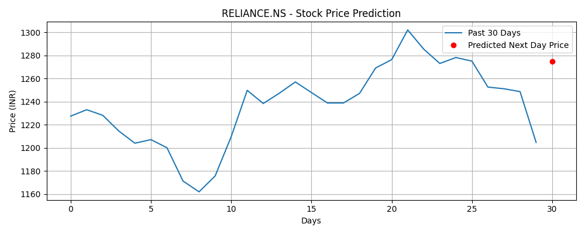

# 📈 Stock Trend Analysis using LSTM and Flask

This project is a web-based stock price prediction app that uses an LSTM (Long Short-Term Memory) deep learning model to forecast the next day's stock closing price. The user can input any valid stock ticker (e.g., `RELIANCE.NS`) and view predictions along with a plot of past and predicted prices.

---

## 🧠 Features

- 🔮 Predicts next-day stock price using an LSTM model
- 📉 Fetches real-time stock data using `yfinance`
- 📊 Displays trend graph of the past 30 days with the prediction
- 🌐 Flask web app with a clean UI
- 🎨 Styled with custom CSS

---

## 🚀 Demo

---

## 🛠️ Tech Stack

- **Frontend**: HTML, CSS (Vanilla)
- **Backend**: Python, Flask
- **ML Model**: TensorFlow Keras (LSTM)
- **Data Source**: yFinance
- **Plotting**: Matplotlib

---

